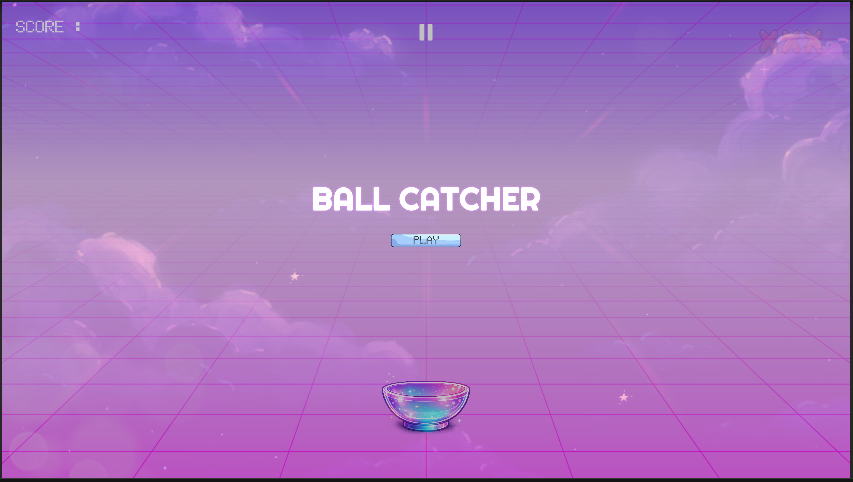
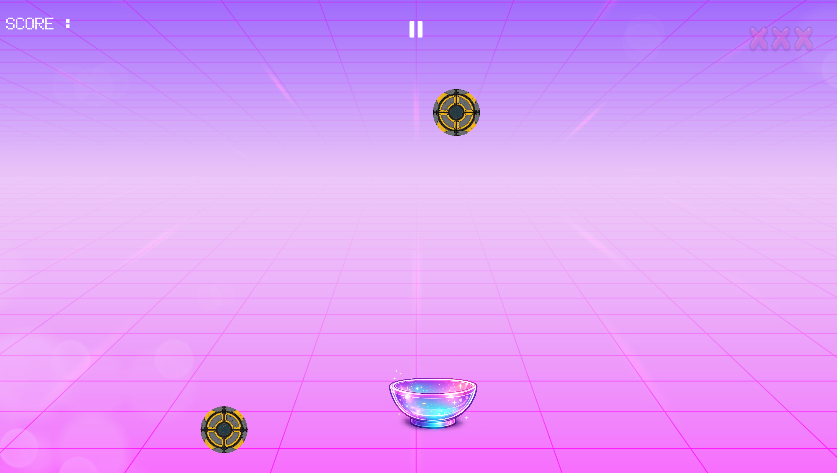
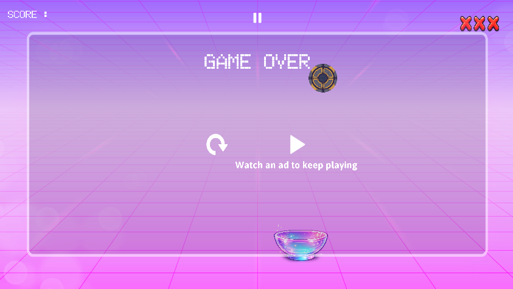

# Hypercasual Catch Game

A Unity 2D hypercasual game where players control a movable bowl to catch falling objects while avoiding missed catches that reduce player lives. The project focuses on responsive gameplay loops, object pooling optimization, score tracking, and lightweight arcade-style mechanics.

---

## Features

- Horizontal player movement system
- Falling object spawning mechanics
- Object pooling optimization
- Catch detection system
- Score tracking
- Life management system
- Game over handling
- Audio feedback integration
- Hypercasual gameplay loop
- Organized gameplay architecture

---

## Technologies Used

- Unity 6
- C#
- Unity UI System
- Rigidbody2D Physics
- Object Pooling System

---

## Gameplay Overview

Players move a bowl horizontally to catch falling objects spawned from above. Successfully catching objects increases the score, while missing them reduces player lives.

The game continues until all lives are lost, creating a fast-paced arcade-style gameplay loop focused on reaction speed and timing.

---

## Core Systems

### Player Systems
- Horizontal movement controls
- Responsive input handling
- Bowl collision interactions

### Gameplay Systems
- Falling object spawning
- Catch detection
- Score tracking
- Life management
- Game over conditions

### Optimization
- Reusable object pooling system
- Organized prefab and asset management
- Lightweight hypercasual gameplay architecture

### Audio Systems
- Catch sound effects
- Miss/fail feedback sounds
- Background music integration
- UI interaction feedback

---

## Project Structure

```bash
Assets/
│
├── Audio/
├── Materials/
├── Prefabs/
├── Scenes/
├── Scripts/
│   ├── Audio/
│   ├── Gameplay/
│   ├── Managers/
│   ├── Player/
│   ├── Pooling/
│   └── UI/
│
├── Sprites/
├── Settings/
└── Screenshots/
```

---

## Controls

| Action | Input |
|---|---|
| Move Left | A / Left Arrow |
| Move Right | D / Right Arrow |

---

## Screenshots

### Main Menu


### Gameplay


### Game Over


---

## Future Improvements

- Increasing difficulty progression
- Combo scoring system
- Mobile touch controls
- Power-up mechanics
- Additional object variations
- Leaderboard support

---

## Author

**Abin George**

GitHub: https://github.com/abinshabi-netizen